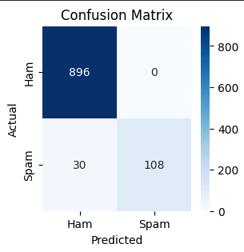
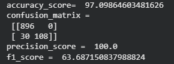

# 📧 Email Spam Classifier

An NLP-powered web application that classifies emails or messages as **Spam** or **Not Spam (Ham)** using Machine Learning and Natural Language Processing techniques. The application uses **TF-IDF Vectorization** and a **Multinomial Naive Bayes** classifier to provide real-time predictions through a Flask-based web interface.

## 🏠 Home Page


## 🌐 Live Demo

🔗 **Live Application:** https://email-spam-classifier-gold.vercel.app

---

## 🚀 Features

* ✅ Classifies messages as **Spam** or **Not Spam**
* ✅ Text preprocessing and cleaning
* ✅ TF-IDF Vectorization for feature extraction
* ✅ Multinomial Naive Bayes classification
* ✅ Interactive and responsive user interface
* ✅ Real-time message prediction
* ✅ Model evaluation using accuracy and precision
* ✅ Flask-based web application

---

## 🛠️ Tech Stack

### Machine Learning & NLP

* Python
* Scikit-learn
* Pandas
* NumPy
* NLTK
* TF-IDF Vectorization
* Multinomial Naive Bayes

### Web Development

* Flask
* HTML5
* CSS3
* JavaScript

### Deployment

* Vercel

---

## 📊 Dataset

The model was trained using the **SMS Spam Collection Dataset**, which contains SMS messages labeled as either spam or legitimate (ham).

🔗 **Dataset:** [Kaggle – SMS Spam Collection Dataset](https://www.kaggle.com/datasets/uciml/sms-spam-collection-dataset)

**Dataset Source:** UCI Machine Learning Repository / Kaggle

---

## 📂 Project Structure

```text
Email-Spam-Classifier_IBM-SkillsBuild/
│
├── static/
│   ├── home_page.png
│   ├── confusion_matrix.png
│   ├── evaluation_score.png
│   └── style.css
│
├── templates/
│   └── index.html
│
├── app.py
├── model.pkl
├── vectorizer.pkl
├── requirements.txt
├── .gitignore
└── README.md
```

---

## 📈 Model Performance

### Confusion Matrix



### Evaluation Metrics



| Metric        | Score      |
| ------------- | ---------- |
| **Accuracy**  | **97.09%** |
| **Precision** | **100%**   |

---

## 🧠 Machine Learning Workflow

1. Data Collection
2. Data Cleaning and Preprocessing
3. Text Tokenization
4. Removal of Stopwords and Punctuation
5. Stemming using Porter Stemmer
6. TF-IDF Feature Extraction
7. Model Training
8. Model Evaluation
9. Flask Web Application
10. Deployment

---

## 📊 Model Pipeline

```text
Input Message
      ↓
Text Preprocessing
      ↓
TF-IDF Vectorization
      ↓
Multinomial Naive Bayes Model
      ↓
Spam / Not Spam Prediction
```

---

## ⚙️ Installation and Setup

### 1. Clone the Repository

```bash
git clone https://github.com/SandeepKumarSha/Email-Spam-Classifier_IBM-SkillsBuild.git
```

### 2. Navigate to the Project Directory

```bash
cd Email-Spam-Classifier_IBM-SkillsBuild
```

### 3. Create a Virtual Environment

```bash
python -m venv myenv
```

### 4. Activate the Virtual Environment

#### Windows

```bash
myenv\Scripts\activate
```

#### macOS/Linux

```bash
source myenv/bin/activate
```

### 5. Install Dependencies

```bash
pip install -r requirements.txt
```

### 6. Run the Application

```bash
python app.py
```

The application will be available at:

```text
http://127.0.0.1:5000
```

---

## 👨‍💻 Author

**Sandeep Kumar Sha**

* GitHub: https://github.com/SandeepKumarSha
* LinkedIn: https://www.linkedin.com/in/sandeepkumarsha

---

## 📜 License

This project is created for **educational and learning purposes** as part of the IBM SkillsBuild learning experience.
